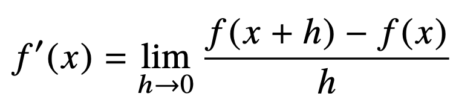
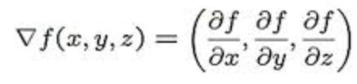

# TIL 220920

## 경사하강법(Gradient Descent)
### (순한맛)

경사하강법이란? 함수값이 낮아지는 방향으로 값을 변형시켜 하강법의 경우 함수의 최소값을 갖도록 하는 값을 찾는 방법이다.

### 미분

- 미분이란? 순간변화율로서, f'(x) 란 x에서의 순간 변화율을 의미한다.  = 접선의 기울기

~~~python
import sympy as sym
from sympy.abc import x
sym.diff(sym.poly(x**2 + 2*x + 3), x)
# x^2 + 2x + 3을 x에 대해서 미분한 다항식
~~~

미분값으로 알아낸 접선의 기울기를 통해 현재 시점이 증가하고 있는지, 감소하고 있는 지 판단하고, 이를 통해 미분값을 더하면 경사 상승값이라고 하며 함수의 극대값의 위치를 구할 때 사용하고, 빼면 경사 하강법이라고 하며 함수의 극소값의 위치를 구할 때 사용한다.

~~~python
var = init
grad = gradient(var)
while(abs(grad) > eps):
    var = var - lr * grad # 경사 하강법 이기 떄문에 빼준다. 
    grad = gradient(var)
~~~

만약 다변수 함수라면 편미분을 사용한다.

- 편미분이란 ?

한 변수에 대해서만 미분하는 것으로, 다른 변수는 상수로 취급된다.

- gradient vetor란? 

각 변수에 대해서 편미분 한 것을 벡터로 만든 것으로서, 3변수라면 다음과 같이 표현된다.

때문에 이 경우에는 다변수함수이기 때문에 미분 한 값이 벡터로 나타나 지고, 종료 조건을 다음과 같이 설정한다.

~~~python
var = init
grad = gradient(var)
while(norm(grad) > eps):
    var = var - lr * grad # 경사 하강법 이기 떄문에 빼준다. 
    grad = gradient(var)
~~~
