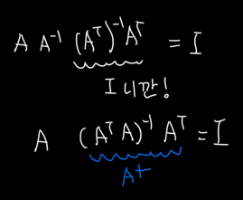
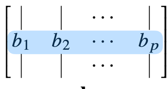

# TIL  220921

오늘은 peer session이 피었읍니다.. 라는 것을 함.. 
어제도 물론 ~ 바로 뻗어서 ㅋ 5시에 일어나 버려가지구 다시 잘까 하다가 밀린 일들을 좀 처리 하고..
사실 어제 밤에 데이터 날려먹어서 다 다시 설치 하느라 애 먹었다..

다시 본론으로 들어가면 오늘 목표는 수학 뿌시기..

수학전공이라고 이제 어디가서 말도 못하겠음 (과외해서 안까먹었따 진짜..)ㅎ

정리해보겠슴

# What is norm?

수학과여서,, 그래도 벡터는 기억 나서 중요 부분만 작성하겠슴

### - L1 norm : eg) (-2, 3, 4) => 2 + 3 + 4   성분의 절댓값 더한 것 

### - L2 norm : eg) (-2, 3, 4) => (4 + 9 + 16)^(1/2) 성분 제곱 더하기 루트 

## 두개를 어떻게 쓰냐에 따라서 기하학적 성질이 달라진단다!!!

보통 L2 norm은 내적과 연관되어있어서 더  많이 쓰였던 것으로 기억..

그렇다면 내적은 무엇이냐 

# Inner Product 

근데 맨날 과에서 norm이라고 했는데 구수하게 노-름 하셔서 헛갈림

## |x|_2 |y|_2 cosθ = x * y 

스스로를 내적하면 길이가 나오는데 각  벡터의 길이와 벡터 사의 각도에 대한 코사인 값을 곱하면 elementwise 로 곱한다음 더한 값인 inner product 의 결과 값과 같다

|x|_2 cosθ 는 y 벡터로 x 벡터를 "정사영" 한 것 과 같다. (projection)

# Matrix 

행렬이란, 앞에서 벡터를 점이라고 생각했다면, 행렬은 그 점들의 집합을 이야기 한다.
내 생각 : 점들의 집합을 이야기 하기 때문에 데이터들의 집합체로 이야기 할 수 있고, 만약 이걸 회귀분석하고 싶다면 이 점들의 특징들을 표현 할수 있는 weight 들을 찾는 것이 실험의 목적이 되지 않을까? 싶음

### 행렬 곱셈(matrix multiplication)
행렬 곱셈(matrix multiplication)은 i 번째 행벡터와 j 번째 열벡터 사 이의 내적을 성분으로 가지는 행렬을 계산한다!

이 부분은 넘어가자 ㅎ 모르면 문제가 있는 것임.. (나의 경우에,,)

* 행렬 끼리의 내적은 elementwise product 연산을 하는 것이므로 벡터끼리의 내적과 차이가 있으니 조심!

### Inverse Matrix

역 행렬에 대해 알아보자!

어떠한 행렬 A 에 대한 역행렬이란 A^(-I) 로 표현하며 (1 아님 ;;) 둘이 곱셈연산(내적 말고)을 진행했을 때 항등행렬(I)이라는 대각선부분만 1이고 나머지가 0인 NxN 행렬이 나오는 행렬을 뜻한다.

아 위에 설명을 안했지만 (NxM) (MxR) 같이 앞 행렬의 끝 차원과 뒷 차원의 맨 앞차원이 같아야 연산 가능하다. 떄문에 역행렬을 구하려면 NxN 행렬만 가능함.
그리고 역행렬을 구하는 방법에는 determinant값을 구해서 역행렬을 구하는 방법도 있는데(보통 그 방법을 제일 많이 쓰고 아니면 노가다 해야됐던걸로 기억) 근데 det 값이 0이 되면 역행렬이 존재 하지 않는다. 

하지만 우리는 NxM 의 역행렬 비슷? 한 것도 찾을 수 있었는데..

### Moore-Penrose Inverse Matrix
유사 역행렬이라고도 부름

ㅋㅋㅋ와 진짜 말도 안되는 증명이긴 한데 일단 외워야 하니깐.. 오랜만이라 다 까먹었어요 교수님 ㅠ

## np.linalg.pinv
위의 numpy 내장 함수를 사용하면 데이터를 선형모델(linear model)로 해석
하는 선형회귀식을 찾을 수 있단다

### 3, 4강 경사 하강법은 20일에 미리 과제가 궁금해서 들어서 거기로 고고

## 활성화 함수

중요한 부분이죠오,,

### 활성화 함수의 역할

앞에서는 방정식을 푸는 것처럼 y = Xb 형식의 모델을 봤다면, 지금은 두둥! 
O = WX + b weight 와 bias를 통해 비 선형 모델을 봐보겠다

d 개의 변수로 p 개의 선형모델을 만들어서 p 개의 잠재변수를 설명하는 모델을 상상해볼 수 있다.

이러한 활성화 함수의 종류로는 여러가지 있지만 대표적으론 
- softmax : 곡선형태로 -1부터 1까지의 값을 표현하며, classification model에 주로 쓰인다. 

또한 층이 깊어질 수록 목적함수를 구하는데 필요한 노드의 갯수가 줄어 효율적으로 학습이 가능하다. 