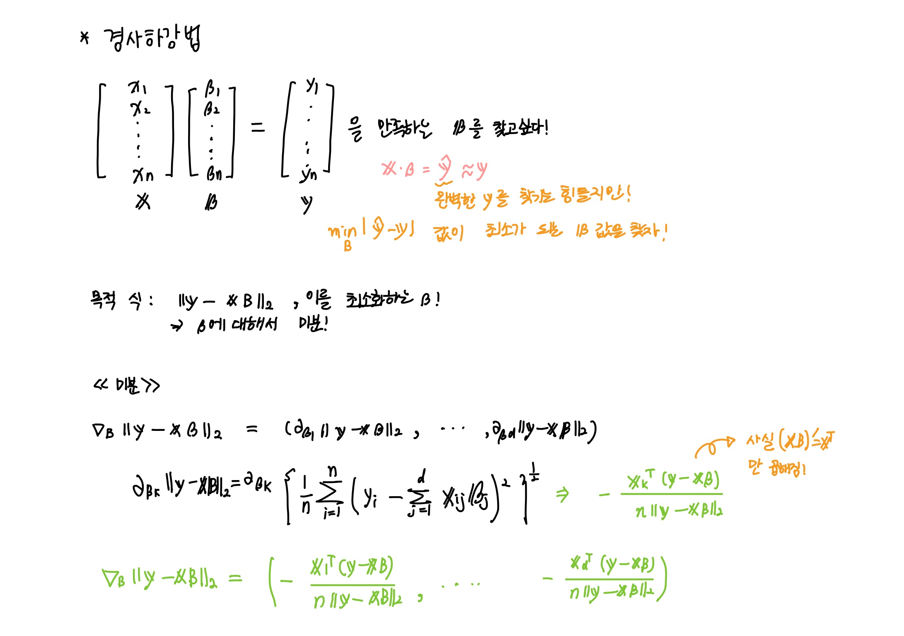

# TIL 220923

## 경사하강법
### 매운맛

앞에 경사하강법 순한 맛을 보고싶다면 20일 til로~!

## 경사하강법 기반 선형회귀 알고리즘

~~~python
for t in range(T):
    error = y - X @ beta
    grad = - transpose(X) @ error
    beta = beta - lr * grad
~~~

**이론적으로 , 경사 하강법은 미분 가능하고 볼록한 함수에 대해선 적절한 학습률과, 학습 횟수를 선택했을 때 수렴이 보장 되어있다.**

## 확률적 경사 하강법 (stochastic gradient descent)

모든 데이터를 사용하지 않고 일부 데이터(미니배치)를 활용해 업데이트 하는 방법으로, 볼록이 아닌(non-convex) 목적식은 SGD를 통해 최적화할 수 있다.

SGD 는 데이터의 일부를 가지고 패러미터를 업데이트하기 때문에 연산자원 을 좀 더 효율적으로 활용하는데 도움이 된다. 