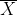
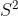

# TIL  220919

이게 맛보기라구요,,? 

허허,, 아침에 통계학 부분 강의 듣다가 멘붕와서 바로 정리하지 않으면 큰일날것을 예감하고 호다닥 먼저 적어본다..

## Statistics
## 모수란? (parameter)
- 모집단의 특성을 나타내는 값! 때문에 데이터의 분포를 알아내기 위해서는 모수를 알아내는 것이 중요하다. 
- 하지만.. 그 분포에 따른 모든 데이터를 알기엔 세상에는 데이터가 너무 많고,, 
- 때문에 우리는 통계적 모델링을 통해 분포를 적절히 가정 하고 우리가 가진 유한한 데이터를 통해 확률 분포를 추정! 하는 방법을 사용 할 예정이다.
- 통계정 모델링을 가정으로 확률 분포를 추정하는 방법에는 2가지가 있는데!
1) 모수적 방법론 : 특정한 확률분포를 따른다고 가정하고 추정함
2) 비모수적 방법론 : 특정한 확률분포를 따른다고 가정하고 추정함

그렇다면 어떠한 확률 분포가 존재하는지를 찾아봐야겠죵?

| 이산형 확률 분포                       | 연속형 확률 분포                        |
|---------------------------------|----------------------------------|
| 베르누이 분포 : 2개의 값 만 가지는 경우        | 베타 분포 : 데이터가 [0,1] 사이에서 값을 갖는 경우 |
| 카테고리 분포 : 3개 이상의 이산적인 값을 가지는 경우 | 감마분포, 로그 정규 분포 : 0 이상의값을 갖는 경우   |
|                                 | 정규 분포, 라플라스 분포 : R 전체에서 값을 갖는 경우 |

## 표본 평균 , 표본 분산
- 앞에서 모집단의 모든 분포를 알 지 못하기 때문에 우리가 가지고 있는 유한한 데이터를 가지고 모집단의 확률 분포를 추정해보자~ 했었음
- 그래서 우리는 우리가 가지고 있는 유한한 데이터를 활용해 볼 껀데, 이때 우리가 가지고 있는 데이터를 가지고 표본을 만들꺼임
- 갖고 있는 데이터 중에 N개의 데이터를 가지고 평균을 낸 것을   , 분산을 낸 것을  라고 한다.
- 이때 분산은 편차 제곱을 다 더한 값에 대해 1/N 을 하는 것이 아니라, 불편 추정량을 구하기 위해 N-1으로 나눈다.
- 표본은 많이 만들 수 있기 떄문에  에 대한 분포가 또 생길 수 있을 텐데, 이때 N의 값이 커질 수록 정규분포를 따른다. (표본 평균에 대한 분포가 정규분포를 따른다는 거임!)
- 이것을 중심극한 정리 (Central Limit Theorem)이라고 한다.

아 최대 가능도 추정법 까지 할라고 했는디 일단 이따가 멘토링을 위해서 호다닥 심화과제를 보고 오겠음!
### 최대 가능도 추정법
- 최대 가능