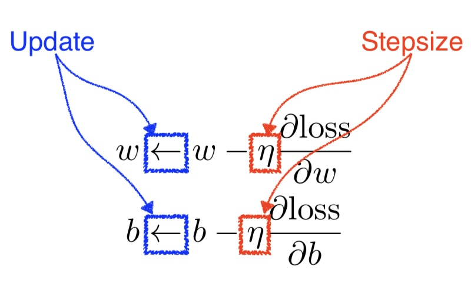
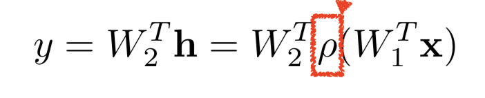
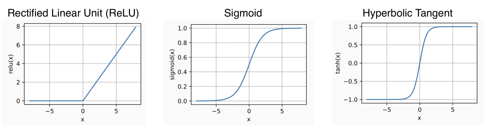
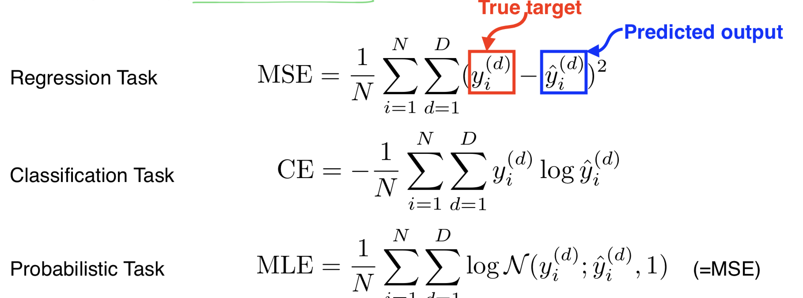

# TIL 221004

날짜 쓸 때 22 다음 0이 오지 않는 다는 것이 굉장히 낯설다,, 이번주는 DL 과 data viz! 

data visualization은 안수빈 마스터님과 진행했는데..
오랜만입니다..*^^*ㅋㅋㅋ 햇병아리이던 제가 부캠에 왔다고요 멘토님,,

data visualization은 이미 안수빈 멘토님과 함께 공부했던 기록이 있어서 그 부분 링크를 첨부하도록 하겠다!

[< 📊🥰 >](https://github.com/yhw991228/damentor_3/blob/main/FINAL_SAMHYUNTECH-%EC%8B%9C%EA%B0%81%ED%99%941-blue.ipynb)

그럼 새로 알게 된 부분.. 정리 해보겠다!

# DL Basic 2. Neural Networks & Multi-Layer Perceptron

보통 신경망으로 이야기를 하는데.. 사실 신경망에 영감을 받은것이고 굳이 신경망의 형태를 따를 필요는 없다~ 하는 것이 교수님의 생각이신 것 같았다.

그래서 신경망이 뭐냐,,? 

*신경망이란 함수로서, 비 선형 transformation으로 쌓여진 approximators이다.*

그래서 비선형 형태가 반복되어 input과 output을 이어준다. 
그렇다면 가장 기본적인 부분부터 살펴보자

## Linear Neural Networks

보통 모델하면 3가지를 살펴 볼 수 있는데, 데이터와, 모델과, loss 이다. 보통 이런 Loss가 줄어드는 형태로 학습을 시키게 되고, loss를 계산하는 방법에는 여러가지가 있다. 

그래서 이러한 loss를 줄어들게 하기 위해서 고민을 해봐야 하는데, w를 , 즉 weigth를 어떠한 방식으로 줄여 나가야 loss가 최소화 되는지 알아보기 위해 loss를 w 에 대해서 미분한다. (bias 도 마찬가지!)

그러면서 weight를 업데이트 해 나가게 된다! 

이때 stepsize를 곱할 수 있는데, 미분 된 값은 미분 된 지점 그 주변에서만 사용되는거기 떄문에 적당히 잡아되고, 우리는 loss를 줄여나가는 연산을 하는 거기 떄문에 빼게 됨!

이런식으로 연산을 하게 되면 weight와 bias가 이 모델을 표현하는 값이 되게 된다!
(weight와 bias를 알고 있다면 내가 어떠한 데이터를 넣었을 때 예측 되는 값으로 어떤 값이 나오는지를 알 수 있겠지?)

그렇다면 내가 weight를 많이 쌓을 수록 deep~ 한 신경망이 될텐데,, 사실 weight layer를 많이 쌓기만 한다고 좋은 것이 아니라,, 그러면 그냥 선형 변환과 다를 게 없어진다! 그래서 우리는 사이에 activation function을 추가해 비선형성을 추가해주고자 한다!

 
⬆️ 요기 빨갛게 표시된 친구가 활성화 함수!

## Activation Function

활성화 함수에는 다양한 종류가 있지만, 대표적으로 다음과 같은 함수들이 있다.

*추가적으로, Universal approximator에 따르면 특정 조건을 만족하면 이것을 다 표현할 수 있는 ㅣinear network 가 분명히 존재한다고 나와있다!(존재만,, 찾는 건 우리 몫..)*

## Loss Function

Loss Function은 내가 하고자 하는 task에 따라서 사용하는 loss function이 달라지고, 성능또한 차이 날 수 있다!

